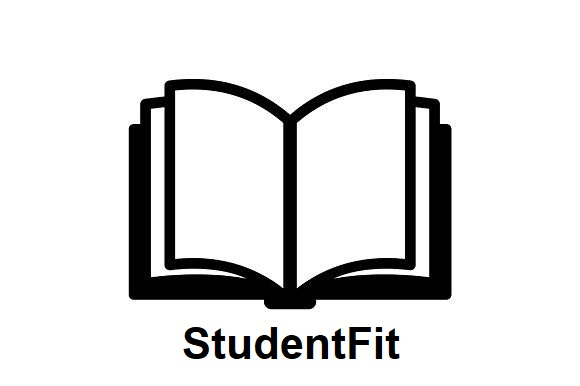

</img>
<h1>StudentFit</h1>
<sub>A new agenda that gives priority to what matters: your health.</sub>

<br>
<h3>So what exactly is StudentFit?</h3>

- StudentFit is an agenda written by high school students, for high school students. It provides a way for students to keep up with schoolwork while remaining physically active and promoting memory retention through curated food suggestions.
<br>
<h3>What features are implemented?</h3>

- Here is a list of the different tools available to users:
    - Home: Describes the purpose of the application as well as how to use it.
    - Calendar: Provides an overview of tests, quizzes, reading, essays, and homework for a student and creates a timeline of upcoming events.
    - To-do List: Allows for viewing upcoming assignments and listing them as completed or not completed(a virtual agenda)
    - Workout Schedule: Provides curated workouts based on upcoming school assignments to enable students to follow a manageable workout schedule.
    - Food Recommendations: Suggests personalized and informative lists of healthy foods customized for upcoming school assignments.

<h3>What Languages/Frameworks Does This Use?</h3>

- To be as bloat-free as possible, StudentFit uses no HTML, CSS, or JS frameworks or libraries.
- The backend is written using Python, with the libraries Pillow and Flask. Read on to make sure all dependencies have been installed on your computer!

<h3>Is my Computer Supported?</h3>

- Any computer that can run Python(which can be downloaded <a href="https://www.python.org/downloads/">here</a>!) can run StudentFit!

<h3>How do I Run StudentFit?</h3>

- Start by downloading the folder on GitHub, which can be done <a href="https://github.com/html1101/StudentFit/archive/refs/heads/master.zip">here</a>.
- <code>cd</code> into the directory StudentFit is being held.
- To download dependencies, use the following command:
```lisp
> pip install flask pillow
```
- Note: if Pip was given a different name in your installation of Pip(eg. <code>py -m pip</code>), replace <code>pip</code> with that name. Keep this in mind as well when running <code>python</code> commands.
- Now it's time to initialize the localhost server! Run this by executing the following:
```lisp
> python backend.py
```
- Now navigate to <a href="localhost:5000/frontend/about.html" target="_blank">localhost:5000/frontend/about.html</a>.
- Your personalized StudentFit has been created! <code>Ctrl-C</code> within the terminal to terminate the server when you're finished, and use the same process to open the server. Don't worry, your events and assignments will be saved!

<h3>That Didn't Work. What Should I Do?</h3>

- Submit an <a href="https://github.com/html1101/StudentFit/issues">issue here</a>, or email us at <a href="mailto:sarahhacks111@gmail.com">sarahhacks111@gmail.com</a>.
